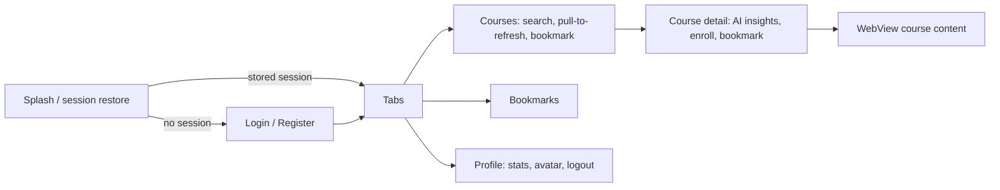
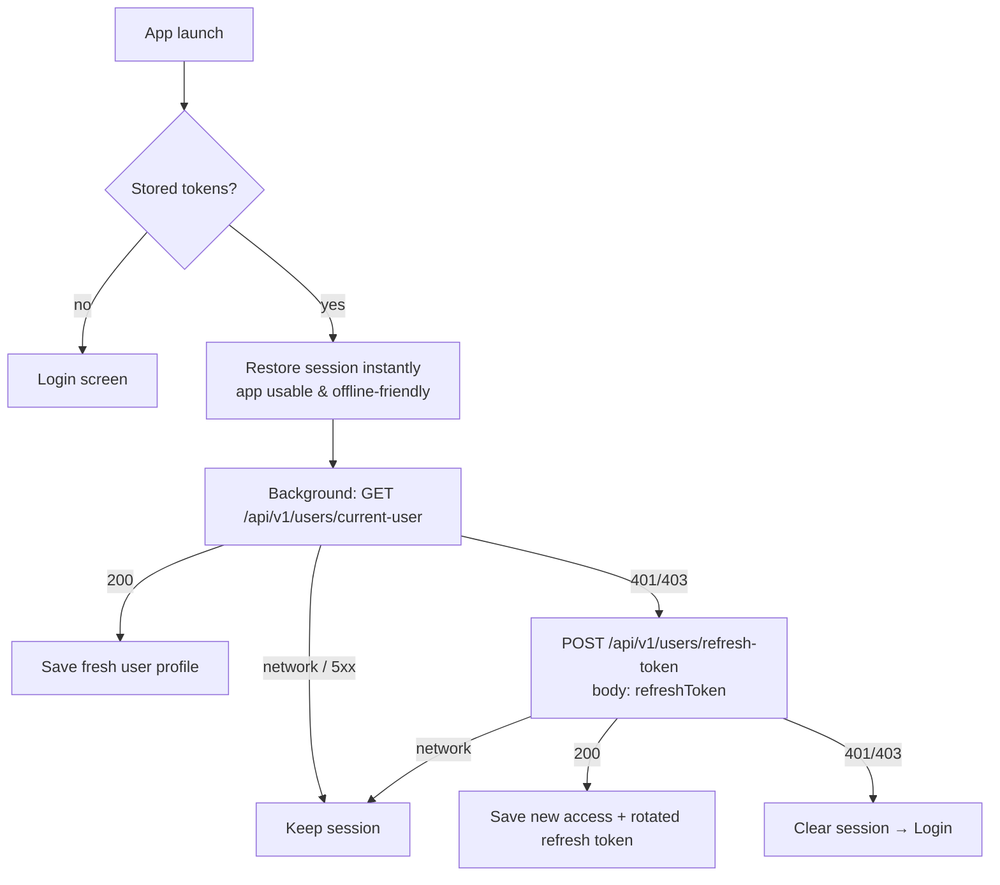
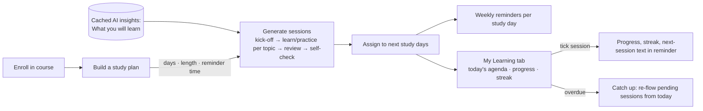

# EduTech LMS — React Native Intern Assignment

A mini Learning Management System built with **React Native + Expo (SDK 56)**, **Expo Router** and **TypeScript**.
This fork contains my submission for the Ada Lovelace Technologies React Native Intern task:

| Deliverable | Where |
| --- | --- |
| 🔍 Findings: bugs, limitations, UX, performance, security (each with a 2–3 line solution) | [Findings](#2-findings--solutions) |
| 🛠️ Resolved limitation: **session restore never validated or refreshed tokens** | [Resolved limitation](#3-resolved-limitation-broken-session-restore) |
| ✨ New feature: **Smart Study Planner** (plans, reminders, catch-up, streaks) | [New feature](#4-new-feature-smart-study-planner) |
| ⚙️ Setup, testing and APK build instructions | [Setup & testing](#5-setup--testing) |
| 📦 Android preview APK | [**Releases →**](../../releases/latest) |

**At a glance:** 46 findings · 32 fixed in code · 19 unit tests · `tsc` clean · `expo-doctor` 21/22 (the remaining check needs the SDK 57 upgrade, see P4)

---

## Contents

1. [How I explored the app](#1-how-i-explored-the-app)
2. [Findings & solutions](#2-findings--solutions)
3. [Resolved limitation: broken session restore](#3-resolved-limitation-broken-session-restore)
4. [New feature: Smart Study Planner](#4-new-feature-smart-study-planner)
5. [Setup & testing](#5-setup--testing)
6. [Project structure & architecture](#6-project-structure--architecture)
7. [Commit history](#7-commit-history)

---

## 1. How I explored the app

**Existing feature flow**



**Method**

1. **Read the whole codebase** (about 1.8k lines): every screen, provider, store and util.
2. **Scenario and edge-case walkthrough on Android:** auth, catalog, bookmarks, enrollment, AI insights, WebView, notifications and offline (the full list is [below](#test-scenarios)).
3. **Probed the real backend with `curl`** to confirm suspected bugs instead of guessing. This is how the most serious bug (S1) was proven: the app's token-check URL returns FreeAPI's Swagger HTML page with status `200`.
4. **Ran tooling:** `tsc --noEmit` (failed at baseline), `npx expo-doctor` (4 failed checks at baseline), and an Android bundle export.
5. **Ranked each finding** by user impact and fixed the ones with the best impact-to-risk ratio. Every fix keeps existing behaviour and is covered by `tsc` plus unit tests where the logic is pure.

**Severity:** 🔴 Critical/High · 🟠 Medium · 🟢 Low  **Status:** ✅ Fixed in this repo · 📝 Proposed

---

## 2. Findings & solutions

### 🔐 Authentication & security

| # | Finding | Sev | Feasible solution | Status |
|---|---|---|---|---|
| S1 | **Stored sessions are never really validated.** `verifyAccessToken` requests `${BASE_URL}/users/current-user`, which is missing `/api/v1`. FreeAPI answers unknown paths with its Swagger HTML page and status **200**, so *any* stored token (expired or garbage) counts as valid. | 🔴 | Use the versioned `ENDPOINTS.CURRENT_USER`. Treat only 2xx JSON as valid and branch on the HTTP status. [Details ↓](#3-resolved-limitation-broken-session-restore) | ✅ |
| S2 | **Token refresh can never succeed.** Wrong URL, the refresh token is sent as a `Bearer` header while FreeAPI expects it in the body, and a rotated refresh token is never saved. | 🔴 | POST `{ refreshToken }` to `/api/v1/users/refresh-token` and save both returned tokens. | ✅ |
| S3 | **Opening the app offline logs the user out.** Any network error during startup falls into the `catch` block that clears the stored session. | 🔴 | Tell a network failure apart from an auth failure. Keep the session when the server is unreachable and log out only on 401/403. | ✅ |
| S4 | **Gemini API key published in the README** and shipped inside the JS bundle via `EXPO_PUBLIC_*`, so anyone can extract it from the APK. | 🔴 | Revoke the key (it remains in upstream git history). Move Gemini calls behind a small backend or edge function that holds the key and rate-limits per user. I removed the key from the docs and added `.env.example`. | ✅ docs / 📝 proxy |
| S5 | **The WebView sends the user's bearer token, username and email** as headers to a third-party GitHub Pages site, which can't even read request headers. | 🔴 | Stop sending credentials to third-party origins. If the page ever needs identity, use a short-lived, scoped token passed over `postMessage`. | ✅ |
| S6 | No handling for 401s during a session: a token that expires while the app is open makes calls fail silently. | 🟠 | Add a response interceptor to `request()` that refreshes once on 401, retries the call, and logs out if the refresh fails (one shared in-flight refresh promise). | 📝 |
| S7 | The demo backend (FreeAPI) periodically resets users, so "User does not exist" appears after a logout. | 🟠 | Use a real backend (or Firebase Auth/Supabase) for persistent accounts; until then, show a friendly "account expired, please register again" message for that error. | 📝 |
| S8 | The user profile is cached in plain AsyncStorage. | 🟢 | Store only non-sensitive display fields, or keep the profile in SecureStore alongside the tokens. | 📝 |

### 🐞 Bugs & crashes

| # | Finding | Sev | Feasible solution | Status |
|---|---|---|---|---|
| B1 | **Rules-of-Hooks violation in Course Detail.** `useState`/`useEffect` run *after* an early `return` for "Course not found". If the course list loads while the screen is open, React throws *"Rendered more hooks than during the previous render"*. | 🔴 | Declare all hooks before any conditional return and guard inside the effect. | ✅ |
| B2 | **Bookmarks and enrollments are shared between accounts** on the same device (global AsyncStorage keys, not cleared on logout). | 🔴 | Namespace the keys by user id, reset state on logout, and migrate legacy data once. | ✅ |
| B3 | **Thumbnails change on every render.** `CourseCard` calls `Math.random()` for the list image *and again* for the detail param, so the detail screen shows a different image, and every bookmark tap reloads all images. | 🟠 | Derive a stable, id-seeded URL once, when the course is built (the API's own thumbnail URLs return 404). | ✅ |
| B4 | **Wrong password takes about 2 seconds and 3 requests.** `request()` retries every error, including 4xx responses and non-idempotent POSTs, so a retried register can hit "user already exists". | 🟠 | Retry only GETs, and only on network errors, 5xx or 429. Throw a typed `ApiError` with the status. | ✅ |
| B5 | **The 24h inactivity reminder is inverted.** It only fires when the app *is* opened after 24h, which is exactly when it isn't needed. | 🟠 | Schedule a notification 24h ahead on each launch and replace it on the next launch. | ✅ |
| B6 | **AI failures show fake content.** On error the app shows hard-coded text ("Course concepts…") that looks like real AI output, and the "Generate" retry button can never appear. | 🟠 | Return `null` on failure, show an honest message with a Retry button, and ignore stale responses. | ✅ |
| B7 | **`app.json` schema error.** `android.android.softwareKeyboardLayoutMode` is nested, so the keyboard-resize setting is ignored (`expo-doctor` fails). | 🟠 | Un-nest it under `android`. | ✅ |
| B8 | **Missing required peer dependencies** `expo-font` and `expo-constants`; Expo warns this can crash builds that run outside Expo Go. Several packages are also behind their SDK patch versions. | 🔴 | `npx expo install expo-font expo-constants` and `npx expo install --fix`. | ✅ |
| B9 | **Builds without `.env` are broken.** `BASE_URL` becomes `undefined`, and `.env` is git-ignored, so EAS cloud builds never see it. | 🔴 | Default to `https://api.freeapi.app`, and set per-profile env in `eas.json` or EAS env vars. | ✅ |
| B10 | Un-enrolling happens on a single tap of the green "✓ Enrolled" button, with no confirmation. | 🟠 | Confirm with a destructive alert (it now also warns that the study plan will be deleted). | ✅ |
| B11 | Uppercase usernames are rejected by the server with a vague "Received data is not valid". | 🟠 | Validate on the client with Zod (lowercase letters, numbers, `._-`) so the field-level message appears before submitting. | ✅ |
| B12 | The 5-bookmark notification fires again every time the count dips and returns to 5. Side effects run inside `setState` updaters, which React may call twice. | 🟢 | Move side effects out of the updaters and notify only when crossing the milestone upward. | ✅ |
| B13 | The offline banner flashes at launch because `isInternetReachable` is `null` while it's being probed. | 🟢 | Treat `null` as unknown/online and show the banner only on an explicit `false`. | ✅ |
| B14 | A picked profile photo resets on every restart. | 🟢 | Persist the URI per user (upload to storage once a backend exists). | ✅ |
| B15 | Search with a trailing space returns no results, and an email with a trailing space fails login validation. | 🟢 | Trim (and lowercase email) before filtering and validating. | ✅ |
| B16 | A failed pull-to-refresh is silent when the list already has items (the error only shows in the empty state). | 🟢 | Show an inline "couldn't refresh, showing saved list" notice. | ✅ |

### ⚡ Performance

| # | Finding | Sev | Feasible solution | Status |
|---|---|---|---|---|
| P1 | `memo(CourseCard)` does nothing: every card reads the bookmarks context, so one bookmark tap re-renders all cards. | 🟠 | Pass `isBookmarked` and a stable `onToggleBookmark` as props, and wrap `renderItem` in `useCallback`. | ✅ |
| P2 | Gemini is called on every visit to Course Detail, with no caching, which costs quota and time. | 🟠 | Cache insights per course in AsyncStorage (a TTL could be added), and use JSON response mode. | ✅ |
| P3 | Only the first 20 of 100 courses ever load; there's no pagination. | 🟠 | Use `onEndReached` with a `page` param and the API's `nextPage` flag; append and de-duplicate by id. | 📝 |
| P4 | Expo SDK 56 ships Hermes V1 with a known memory regression (flagged by `expo-doctor`). | 🟠 | Upgrade to SDK 57 (`npx expo install expo@^57 --fix`) on its own branch and run a full regression pass. | 📝 |
| P5 | The full course description is passed through router params and the WebView URL. | 🟢 | Pass only the course id and read the rest from the store (or fetch by id). | 📝 |
| P6 | No offline catalog, so Bookmarks and Detail are empty when offline or on a cold start. | 🟠 | Cache the last catalog, render it instantly, and revalidate in the background. | ✅ |

### 🎨 UX & accessibility

| # | Finding | Sev | Feasible solution | Status |
|---|---|---|---|---|
| U1 | Enrolling has no purpose: enrolled courses have no home and no progress. | 🟠 | A "My Learning" tab with plans, progress and reminders. **This is the new feature.** | ✅ |
| U2 | The WebView error screen is a dead end with no Retry. | 🟢 | Add a Retry button that remounts or reloads, and handle `onHttpError`. | ✅ |
| U3 | Nothing shows that tapping the avatar changes the photo. | 🟢 | Add a "Tap to change photo" hint and an accessibility hint. | ✅ |
| U4 | Icon-only buttons (bookmark) have no accessibility labels, and the tap targets are small. | 🟢 | Add `accessibilityRole` and `accessibilityLabel`, and increase `hitSlop`. Done on the touched components; audit the rest. | ✅ partial |
| U5 | The notification permission is requested on first launch, before the user sees any value. | 🟢 | Ask in context, e.g. when creating a study plan (done for the planner). Move the launch prompt behind an in-app explainer. | 📝 |
| U6 | No password visibility toggle and no "Forgot password". | 🟢 | Add an eye toggle to `secureTextEntry`, and a forgot-password flow backed by FreeAPI's `/users/forgot-password`. | 📝 |
| U7 | Double-tapping a card quickly pushes the detail screen twice. | 🟢 | Guard navigation with an in-flight ref or a short debounce. | 📝 |
| U8 | The catalog is made of e-commerce products (phones, groceries) with USD prices, shown as "courses". | 🟢 | Use a real course API or backend, or map categories to course topics, and localise the currency (₹). | 📝 |
| U9 | No dark mode (`userInterfaceStyle: "light"`). | 🟢 | NativeWind `dark:` variants with `userInterfaceStyle: "automatic"`. | 📝 |
| U10 | A deep link to `/course/:id` before the catalog loads shows "Course not found". | 🟢 | Fall back to fetching the single product by id. Partly mitigated by the catalog cache. | 📝 |

### 🧹 Code quality & tooling

| # | Finding | Sev | Feasible solution | Status |
|---|---|---|---|---|
| Q1 | `tsc` fails at baseline (untyped `global.css` import). | 🟢 | Declare `*.css` modules in `nativewind-env.d.ts`. | ✅ |
| Q2 | Dead state in `CourseProvider` (`isLoading`, `error`, `refreshFlag`, `refresh`), plus `any` and unsafe casts around AI and login. | 🟢 | Remove unused state, type the API responses, and validate the AI JSON shape. | ✅ |
| Q3 | No tests. | 🟠 | Add `jest-expo` and unit-test pure logic (scheduler, session revalidation). **19 tests added.** | ✅ |
| Q4 | No ESLint/Prettier or CI. | 🟢 | Add `eslint-config-expo` and Prettier, and a GitHub Action running `tsc`, lint and tests on each PR. | 📝 |
| Q5 | `console.log` calls in production paths. | 🟢 | Use a small logger that is silent in release builds, plus crash reporting (Sentry). | 📝 |
| Q6 | The README referenced a `.env.example` that didn't exist, and only described development builds. | 🟢 | Add `.env.example` and document the preview APK build. | ✅ |

---

## 3. Resolved limitation: broken session restore

> Covers **S1, S2, S3** (plus B4, which came up while fixing them). The README advertises *"auto-login on restart"*, but the underlying session logic did not work.

### The problem, proven against the live API

```bash
# URL used by the app (missing /api/v1): returns the Swagger docs HTML with status 200
$ curl -s -o /dev/null -w "%{http_code}" https://api.freeapi.app/users/current-user -H "Authorization: Bearer garbage"
200
# The correct endpoint rejects the same token
$ curl -s -o /dev/null -w "%{http_code}" https://api.freeapi.app/api/v1/users/current-user -H "Authorization: Bearer garbage"
401
# Refresh as the app did it (Bearer header, no body)
$ curl -s -X POST https://api.freeapi.app/api/v1/users/refresh-token -H "Authorization: Bearer <refreshToken>"
{"statusCode":401,...,"message":"Unauthorized request"}
```

**Effects for users:**
- **Expired tokens are never detected.** Access tokens expire after 24h, but the app keeps using the dead token forever, so authenticated calls fail and the refresh path can't run.
- **Opening the app with no network logs you out.** `fetch` throws, and the catch-all block clears the stored session.
- **A wrong password takes about 2 seconds to show an error,** because every 4xx was retried twice with a 1s delay.

### The fix



| File | Change |
|---|---|
| [`utils/api.ts`](utils/api.ts) | `ApiError` with an HTTP status. `revalidateSession()` returns `valid` / `expired` / `unreachable`. `refreshTokens()` sends the token in the body and keeps the rotated token. Retries only GETs on network/5xx/429. An explicit `Authorization` header takes priority over the stored one. |
| [`providers/AuthProvider.tsx`](providers/AuthProvider.tsx) | Restores the session optimistically (no network wait on the splash screen), then revalidates in the background. A `sessionVersion` ref stops a slow check from overriding a login or logout made in the meantime. |
| [`constants/api.ts`](constants/api.ts) | `REFRESH_TOKEN` endpoint, and a safe `BASE_URL` default. |
| [`__tests__/session.test.ts`](__tests__/session.test.ts) | Tests for valid, refresh-and-rotate, expired, offline, and no-retry-on-401. |

**Why this design:** mobile apps are often opened on poor networks. Blocking the splash screen on a network call, or logging out on a timeout, are both common production mistakes. The app should trust local state and let the server revoke it.

**How to verify on a device:**
1. Log in, then kill the app.
2. Turn on airplane mode and reopen: you stay logged in, with the catalog loaded from cache.
3. Enter a wrong password: the error appears immediately, after 1 request instead of 3.

---

## 4. New feature: Smart Study Planner

> *Builds on:* **Enroll** (which previously did nothing but toggle a button), **AI Course Insights** and **Notifications**.

### Why it's useful

Online courses are known for low completion rates: learners enroll, then drift away. Enrolling in this app had no follow-through at all. The Smart Study Planner turns an enrollment into a **personal, adaptive schedule**:

- **It plans for you.** Sessions are generated from the course's AI *"What you will learn"* outcomes, so the plan is specific to the course rather than a generic to-do list.
- **It reminds you.** It sends weekly local notifications on your chosen days and time, and each one names the next session. Tapping it opens the plan.
- **It forgives you.** Missed sessions are highlighted, and **Catch up** reschedules everything left onto your next study days and shows the new finish date. The plan adapts instead of making you feel guilty.
- **It motivates you.** A **study-day streak** counts only the days you planned to study, so resting on a Tuesday doesn't break a Mon/Wed/Fri streak.

### How it works



| Piece | What it does |
|---|---|
| **Plan setup** (`/study-plan/[courseId]`) | Choose study days (S M T W T F S), session length (15–60 min) and a reminder time. A live preview shows the number of sessions, total time and projected finish date before you commit. |
| **Session generation** | Up to 4 AI learning outcomes become *Learn: X → Practice: X* pairs, with a kick-off first and a review and self-check at the end. Without AI (offline or no key) a standard learn→practice path is used, so the feature never depends on the AI. |
| **Scheduling** | Sessions are assigned in order to the next matching weekdays, starting today if today is a study day. |
| **Status & summary** | Each session is *done*, *today*, *upcoming* or ***overdue*** (highlighted in red). The summary shows progress %, remaining time and projected finish. |
| **Catch up** | Re-flows only the unfinished sessions onto study days from today, in order. Completed history is untouched. |
| **Streak** | Counts consecutive scheduled study days with a completed session, working backwards from today. Rest days are skipped, and an unfinished *today* doesn't break the streak. |
| **Reminders** | One `WEEKLY` trigger per study day on an Android `study-reminders` channel. They're re-synced on every change (so the text names the current next session), cancelled when the plan finishes or is deleted or you un-enroll, cleared on logout, and restored on login. |
| **My Learning tab** | Streak card, a *Today* agenda of overdue and due sessions across all courses (tick them off inline), and each enrolled course with its progress bar or a "Create a study plan" prompt. |
| **Also shown** | A plan card on Course Detail once you're enrolled, and a 🔥 streak stat on Profile. |

**Files:**
- **Logic:** [`utils/studyPlan.ts`](utils/studyPlan.ts), pure TypeScript with no React or native imports, so it's fully unit-tested.
- **State and reminders:** [`providers/StudyPlanProvider.tsx`](providers/StudyPlanProvider.tsx) and [`store/studyPlanStore.ts`](store/studyPlanStore.ts) (persisted per user), with reminders in [`utils/notifications.ts`](utils/notifications.ts).
- **UI:** [`app/study-plan/[courseId].tsx`](app/study-plan/[courseId].tsx), [`app/(tabs)/learning.tsx`](app/(tabs)/learning.tsx) and [`components/study-plan/`](components/study-plan/).
- **Tests:** [`__tests__/studyPlan.test.ts`](__tests__/studyPlan.test.ts).

### Try it

1. Open any course, then tap **Enroll Now**. A **Build a study plan** card appears.
2. Pick days, length and time, check the preview, then tap **Create plan & reminders**. Allow notifications.
3. Tick sessions in the plan or in **My Learning → Today** and watch progress and the streak update.
4. **To see Catch up without waiting days:** create a plan with only *today's* weekday selected, then change the device date forward about a week and reopen the app. Sessions show as overdue with a **Catch up** button.
5. **To test reminders:** choose a study day of today and a reminder time a few minutes ahead (or check the scheduled notifications in Android settings).

---

## 5. Setup & testing

### Prerequisites
Node 20+, npm, and an Android device or emulator. For device testing, use a **development build** (the project includes `expo-dev-client`) or run `npx expo start --go` for Expo Go. Local notifications work in both.

### Run locally
```bash
git clone <this-repo-url> && cd Edutech-app
npm install
cp .env.example .env        # add your own Gemini key (optional; the app works without AI)
npx expo start              # press "a" for Android
```

| Variable | Required | Notes |
|---|---|---|
| `EXPO_PUBLIC_BASE_URL` | no | Defaults to `https://api.freeapi.app` |
| `EXPO_PUBLIC_GEMINI_API_KEY` | no | Free key from [Google AI Studio](https://aistudio.google.com/apikey). Without it, the AI card shows "unavailable" and the planner uses the standard path. |

### Quality checks
```bash
npm test               # 19 unit tests (study planner logic + session revalidation)
npm run typecheck      # tsc --noEmit
npx expo-doctor        # 21/22 (remaining: SDK 57 Hermes advisory, see P4)
```

### Build the preview APK (EAS)
```bash
npm i -g eas-cli && eas login
eas init                                # link the project to your Expo account
eas build -p android --profile preview  # "preview" profile outputs an installable .apk
```
To include AI in the build, first add the key as an EAS environment variable, for example `eas env:create --name EXPO_PUBLIC_GEMINI_API_KEY --environment preview`. The downloaded APK is attached to this repo's [GitHub Release](../../releases/latest).

### Test scenarios

| Area | Scenario | Expected |
|---|---|---|
| Auth | Register with `JohnDoe` | Inline "Use lowercase letters…" before any request |
| Auth | Wrong password | Error appears immediately (1 request) |
| Auth | Log in → kill app → airplane mode → reopen | Still logged in, cached catalog shown |
| Auth | Log out → log in as another user | No bookmarks, enrollments or plans from the previous user |
| Catalog | Bookmark a card | Only that icon changes; thumbnails don't reload |
| Catalog | Open a course | Same image as on its card |
| Catalog | Search `"phone "` (trailing space) | Matches are still found |
| Detail | Start with no AI key or offline | "AI insights unavailable" with a Try again button (no fake text) |
| Detail | Tap "✓ Enrolled" | Confirmation dialog, which warns the plan will be deleted |
| WebView | Offline → View Course Content | Error screen with a Retry button |
| Planner | Create a plan → tick sessions → Catch up → delete | Progress, streak and reminders stay consistent |
| Notifications | Tap a study reminder | Opens that course's plan |

---

## 6. Project structure & architecture

```
app/
  (auth)/                 login, register
  (tabs)/                 courses, learning (new), bookmarks, profile
  course/[id]             course detail (AI insights, enroll, plan card)
  study-plan/[courseId]   plan setup & plan view (new)
  webview                 course content
components/               CourseCard, SearchBar, OfflineBanner, study-plan/*
constants/                API endpoints, colours
hooks/                    useNetworkStatus, useToday
providers/                AuthProvider, CourseProvider, StudyPlanProvider
store/                    contexts + persistence helpers (auth, courses, study plans)
utils/                    api (fetch, retry, session), ai (Gemini), notifications, studyPlan (pure logic)
__tests__/                jest-expo unit tests
```

- **Expo Router** with protected routes via `redirect` on the root stack.
- **Context + `useReducer`/`useState`** per domain (auth, courses, study plans). Toggles are kept referentially stable with refs, so memoised lists don't re-render.
- **Offline-first:** the session is restored locally, the catalog, AI insights and plans are cached in AsyncStorage, and the server revalidates in the background.
- **Pure domain logic** (`utils/studyPlan.ts`) is kept separate from UI and native side effects, which makes it easy to unit-test.
- **SecureStore** for tokens; **AsyncStorage** for per-user app data.

**Tech:** Expo SDK 56 · React Native 0.85 · TypeScript (strict) · Expo Router · NativeWind · React Hook Form + Zod · expo-image · expo-notifications · Google Gemini · jest-expo.

---

## 7. Commit history

Each commit is focused and explains the *why*. Run `git log` to read them.

| Commit | Scope |
|---|---|
| `chore:` | app.json schema, missing peer deps, SDK patch alignment, tsc fix, `.env.example` |
| `fix(auth):` | session restore / refresh / offline (the resolved limitation) |
| `fix(catalog):` | thumbnails, memoisation, per-user bookmarks, offline cache, banner flash |
| `fix(ai, webview):` | honest AI states + cache, token leak removed, WebView retry |
| `feat:` | Smart Study Planner + related detail/notification/profile fixes + tests |
| `fix(config):` | default API base URL for builds without `.env` |

---

## Original app screenshots

<p align="center">
  
  
  
  
</p>
